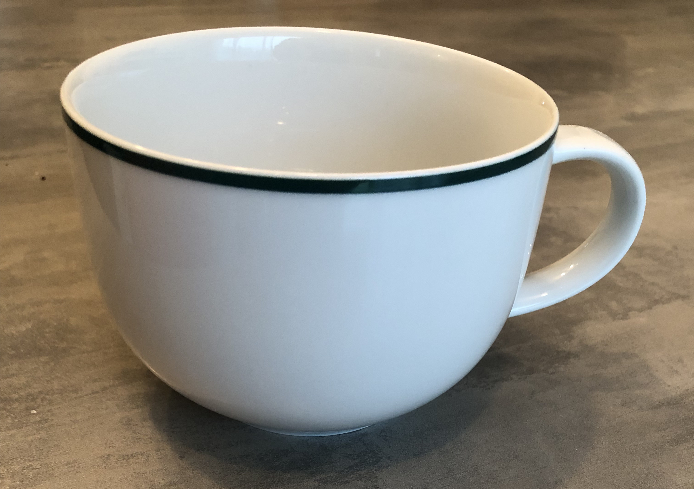

# Tasse à café

Simple cup of tea created from an existing one, right from the drawer

<figure>
    
    <figcaption>Render created using PhotoView360</figcaption>
</figure>

Then, we managed to create a visual representation of the less solid zones using SOLIDWORKS Simulation :

<figure>
    
    <figcaption>Note that this representation is true only for a liquid poured inside and exerting a force on the inside, don't try to smash it on the ground, we all know the output...</figcaption>
<figure>

$$
\\\frac F S = \frac {Re} s
$$